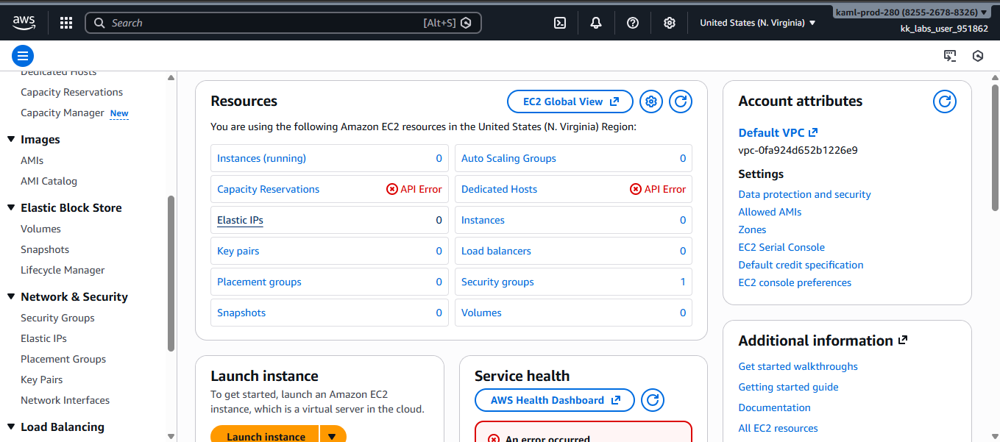
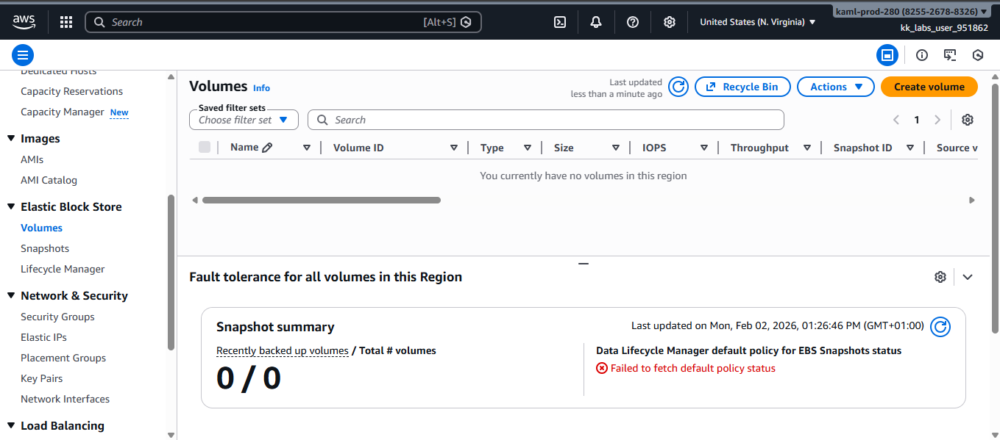
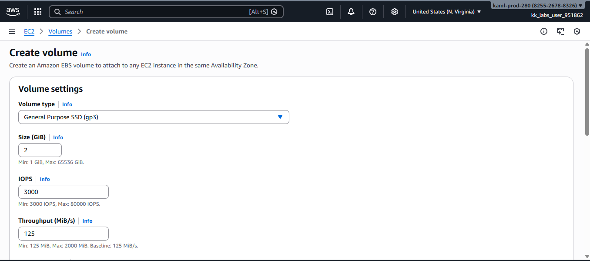
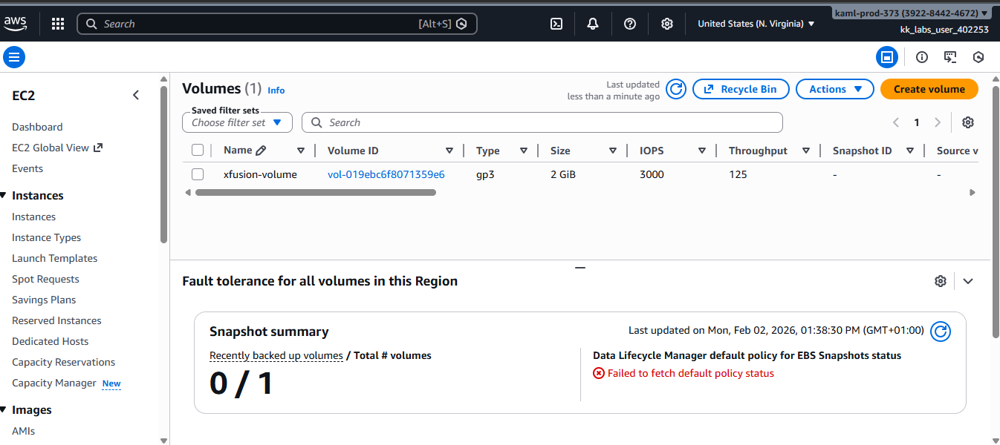

# Create-an-AWS-EBS-Volume

This guide demonstrates how to create an **Amazon Elastic Block Store (EBS)** volume using the AWS Management Console (GUI).

## What is an EBS Volume?

An EBS volume is a persistent block storage service used with Amazon EC2 instances.
It allows you to store data independently of the EC2 lifecycle, meaning data remains available even if an instance is stopped or terminated.
In real-world DevOps and cloud migrations, teams often create and validate storage resources before attaching them to compute instances.

## Step 1: Log in to the AWS Console
Sign in to the AWS Management Console and ensure the correct region is selected.

## Step 2: Navigate to EC2
•	Click Services
•	Select EC2

## Step 3: Open Volumes (Elastic Block Store)
•	In the EC2 left-hand menu, scroll to Elastic Block Store
•	Click Volumes

## Step 4: Create a New Volume
Click Create volume and configure the following:
•	Volume type: 
•	Size: 
•	Availability Zone:

## Step 5: Add Name Tag
Under Tags:
•	Click Add tag
•	Key: Name
•	Value: xfusion-volume

## Step 6: Create the Volume
Click Create volume to complete the process.

## Step 7: Verify the Volume
Confirm the volume was created successfully:
•	Name: xfusion-volume
•	State: Available
•	Type: gp3
•	Size: 2 GiB

## Conclusion
• Creating an EBS volume is a simple but critical step toward building reliable and scalable cloud infrastructure.
• This setup is essential for production workloads and aligns with AWS best practices for persistent storage, durability, and controlled cloud migration.

